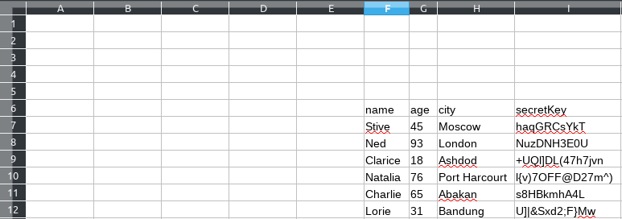

# XLSXWriter
[](https://travis-ci.com/Fizick1/Nopl)
[](https://jitpack.io/#Fizick1/Nopl)

This library is a wrapper over [poi.apache](https://poi.apache.org/) . With this library, you can write your java.class to an Excel file. You do not have to do a lot of actions to write data.
>code in the examples is written in the language of kotlin


## How it works
### Building with JitPack
Use this setup for Maven:
```xml
	<repositories>
		<repository>
		    <id>jitpack.io</id>
		    <url>https://jitpack.io</url>
		</repository>
	</repositories>

  <dependency>
	    <groupId>com.github.Fizick1</groupId>
	    <artifactId>Nopl</artifactId>
	    <version>v0.1.1</version>
	</dependency>
```
and for Gradle:
```groovy
	  allprojects {
		  repositories {
			maven { url 'https://jitpack.io' }
		}
	}
  
  dependencies {
	        implementation 'com.github.Fizick1:Nopl:v0.1.1'
	}
```


## Example

  User.class
```java
class Users(
        val name: String,
        val age: Byte,
        val city: String,
        val secretKey: String
)
```
## #1 Simple record
Easy record of the list with the data in the file ".xlsx". The method creates a file and writes data to it.
```diff
-   If you reuse this method with a list of the same class as before, the old file will be overwritten. 
- Whatever happens, use the following method .
```
```kotlin
    val listUsers = listOf(
            Users("Stive",45,"Moscow","haqGRCsYkT"),
            Users("Ned",93,"London","NuzDNH3E0U"),
            Users("Clarice",18,"Ashdod","+UQl]DL(47h7jvn"),
            Users("Natalia",76,"Port Harcourt","l{v)7OFF@D27m^)"),
            Users("Charlie",65,"Abakan","s8HBkmhA4L"),
            Users("Lorie",31,"Bandung","U]|&Sxd2;F}Mw")
    )
        
    Nopl().writeTable(listUsers)
```
Result:


## #2 Adding data to your workbook
Writes data to your workbook sent in the parameters. The recording is done by adding a new sheet to your workbook.
  If you use this method, you will have to create and save the file yourself.
```kotlin
    val workbook = SXSSFWorkbook()

    Nopl().writeTable(listUsers, workbook)
    
    val file = File("Example.xlsx")
    FileOutputStream(file).use { workbook.write(it) }
```

## #3 Adding data to your sheet
Adds data to your sheet, passed in the parameters. In the case of overlaying one data to the other, the old ones will be retouched. So that when you add new data, the old ones were saved, you can add the settings of the starting positions for the table. Note that the position report starts at 0.
```kotli
//...//
    val workSheet = workbook.createSheet("ExampleSheet")

    val coordinates = StartCell(5,5) 
    
    Nopl().writeTable(listUsers, workSheet,coordinates)
 //...//
```


## #4 Annotating columns
You can also add a note `@ColumnName` in order to override the name of the column that will be displayed in the file. Also, using the `@Output` note, you can exclude this column from output to a file.

```kotlin
class Users(
        @ColumnName("User name")
        val name: String,

        @ColumnName("User age")
        val age: Byte,

        @ColumnName("Location")
        val city: String,

        @Output(false)
        val secretKey: String
)
```


